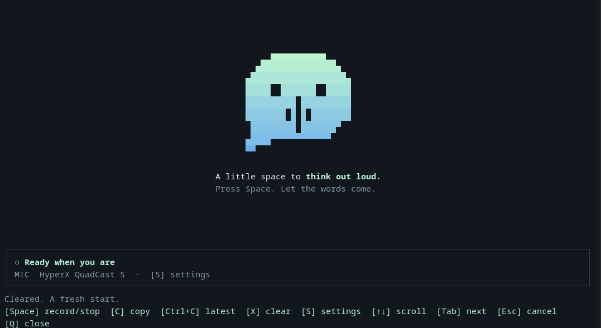
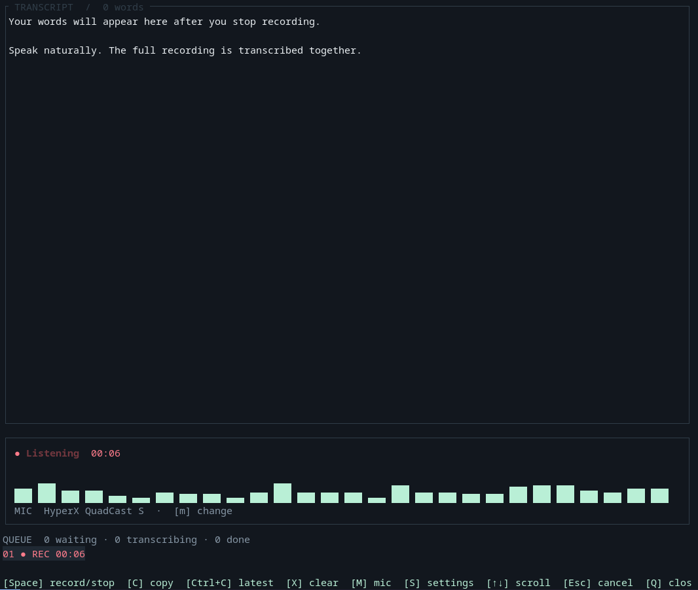

# Pasteface

Record, transcribe, and copy speech from your terminal.

Pasteface is a Rust application built with Ratatui. It combines a dark terminal interface, a microphone level meter, a transcription queue, and a small tray status indicator. Choose local transcription with whisper.cpp or OpenAI's `gpt-transcribe` API.

Press **Space** to record, then **Space** again to enqueue the recording. Start another recording immediately while transcription runs in the background. Each completed chunk appends to the transcript on a new line and copies the combined text to your clipboard.

## Screenshots





## Installation

Install a current stable Rust toolchain and FFmpeg. Local transcription also requires a separate whisper.cpp executable and model; see [Transcription settings](#transcription-settings).

### Linux

Install the native dependencies for the default build, which includes the tray:

```sh
# Arch / Manjaro
sudo pacman -S --needed base-devel pkgconf alsa-lib gtk3 xdotool libayatana-appindicator ffmpeg

# Debian / Ubuntu
sudo apt install build-essential pkg-config libasound2-dev libgtk-3-dev \
  libxdo-dev libayatana-appindicator3-dev libwayland-dev libxkbcommon-dev ffmpeg
```

Clone and install:

```sh
git clone https://github.com/blairjordan/pasteface.git
cd pasteface
./scripts/install-linux.sh
```

The installer builds Pasteface and installs the executable in `~/.local/bin` and a desktop launcher in `~/.local/share/applications`. Ensure `~/.local/bin` is on your `PATH`.

The tray requires a StatusNotifier/AppIndicator host. On i3, `snixembed` can bridge it to an enabled i3bar tray. Recording and the terminal interface also work without a tray host.

### macOS

Install the Xcode command-line tools, Rust, and FFmpeg:

```sh
xcode-select --install
brew install ffmpeg
git clone https://github.com/blairjordan/pasteface.git
cd pasteface
./scripts/bundle-macos.sh
open target/Pasteface.app
```

The script creates an ad-hoc signed application bundle that opens the TUI in Terminal. Grant microphone access when prompted; Terminal may also need microphone permission. This is a source build, not a notarized release. macOS compilation is covered by CI; microphone, menu-bar, and permission behavior still need testing on a Mac.

### Build manually

```sh
cargo build --release --locked
./target/release/pasteface

# Omit the tray and its GTK dependencies.
cargo build --release --locked --no-default-features
```

The tray-free build still requires the platform audio libraries and FFmpeg. Linux and macOS are the target platforms; Windows is not currently supported.

## Usage

Run `pasteface` to open the terminal interface and start the tray companion.

| Key | Action |
| --- | --- |
| **Space** | Start or stop recording; stopping enqueues the chunk |
| **C** | Copy the selected tab’s transcript |
| **Ctrl+C** | Copy only the latest completed chunk |
| **X** | Clear the selected tab’s recordings and transcript after confirmation |
| **S** | Open settings, including microphone selection |
| **Tab / Shift+Tab** | Switch transcript tabs |
| **+** | Create a transcript tab |
| **F2** | Rename the selected tab |
| **↑ / ↓** | Scroll the transcript |
| **Esc** | Cancel active transcription and all queued chunks |
| **Q** | Close the terminal interface |

Click **+** to create a named transcript tab. New recordings append to the selected tab; recording a chunk never creates a tab. Click a tab to switch transcripts, or click a queue block to open its owning tab. Tabs also support **[ / ]** navigation. Right-click a tab and choose **Rename**, or press **F2**, to give it a persistent name.

Click the footer controls to record, copy, clear, cancel, or open settings. Settings and the microphone picker support clicks and the mouse wheel. Scroll over the transcript with the wheel. Drag across transcript text to highlight and copy it; hold **Shift** while dragging to use native terminal selection instead.

The microphone meter responds to your voice while recording. Queue blocks show each chunk's duration and whether it is queued, transcribing, completed, failed, or canceled.

Cancel preserves existing text and recorded audio. It does not stop a recording in progress. Clear is available once recording and transcription have stopped, and does not erase the system clipboard. In a picker or settings dialog, **Esc** closes the dialog instead.

The terminal and tray control the same background recorder. Closing either interface leaves the recorder running. To reopen the terminal, run `pasteface` again or choose **Open terminal** from the tray menu. The tray circle changes with recording and transcription status.

### Command-line controls

```sh
pasteface tui --no-tray  # Terminal interface without starting the tray
pasteface tray           # Tray interface only
pasteface start
pasteface stop           # Enqueue the recording and return immediately
pasteface toggle
pasteface cancel         # Abort active transcription and cancel the queue
pasteface copy
pasteface clear
pasteface status         # JSON state, including transcript and chunk status
pasteface devices
pasteface doctor
pasteface shutdown       # Stop an idle recorder
```

`pasteface retry` retries the oldest failed chunk. No global shortcuts are registered; a window manager or other automation can invoke the CLI commands.

To restart the terminal interface, press **Q** and run `pasteface`. To restart the recorder, first finish or cancel its work, run `pasteface shutdown`, then reopen the app.

## Transcription settings

Press **S** to choose a provider, configure the local executable and model, or enter an OpenAI API key. Settings are saved separately from recorded audio. Provider changes apply to subsequent transcription jobs; an active job keeps the settings with which it started.

### Local whisper.cpp

Local transcription processes audio on your machine. Install an executable and model using the [whisper.cpp instructions](https://github.com/ggml-org/whisper.cpp), then set their paths in Pasteface. The default paths are:

```text
~/.local/lib/whisper.cpp/build/bin/whisper-cli
~/.local/lib/whisper.cpp/models/ggml-large-v3-turbo-q5_0.bin
```

Acceleration is a runtime setting:

| Mode | Behavior |
| --- | --- |
| **Auto** | Let the configured whisper.cpp executable choose its available backend |
| **CPU** | Disable GPU inference for the configured executable |
| **Vulkan** | Use a separately installed Vulkan-capable whisper.cpp executable |

Pasteface does not bundle Whisper models, Vulkan drivers, or a GPU runtime. Vulkan support belongs to the external whisper.cpp installation, so changing it does not require rebuilding Pasteface. Select the appropriate executable in settings and install the Vulkan driver for your GPU. A CPU-only executable does not gain GPU support by selecting Vulkan.

Advanced backend environment overrides, such as `GGML_VK_VISIBLE_DEVICES`, can be set in the `environment` object in `transcription.json`. Supported prefixes are `GGML_`, `VK_`, and `MESA_`.

### OpenAI

Select **OpenAI** in settings and enter your API key in the masked field, or set `OPENAI_API_KEY` before starting the recorder. The default model is **`gpt-transcribe`**; the model name is editable.

When selected, this provider sends completed recordings to OpenAI's audio transcription endpoint. API usage is billed to your OpenAI account. Local mode does not upload audio. Recordings must fit the API's 25 MB file limit after conversion; use shorter chunks for longer sessions.

Keys entered in the app are stored in a separate `secrets.json` file with owner-only permissions (`0600`). They are not included in status responses or transcript files. A saved key takes precedence over the `OPENAI_API_KEY` environment variable.

See the official [file transcription guide](https://developers.openai.com/api/docs/guides/speech-to-text) and [`gpt-transcribe` model documentation](https://developers.openai.com/api/docs/models/gpt-transcribe).

### Audio processing

Capture uses the selected microphone's native sample rate. After stopping, FFmpeg converts the recording to mono 16 kHz PCM. Each chunk is transcribed as a complete recording. Text appears when the chunk finishes; live partial transcripts are not currently displayed.

## Configuration and storage

State is stored in a private application directory: normally `~/.local/state/pasteface` on Linux or the platform application-data directory on macOS. It contains `transcription.json`, the optional `secrets.json`, recorded chunks, processing logs, and the combined transcript.

Each recording has its own directory. One worker drains the queue in order while microphone capture remains available. There is no fixed chunk-count limit; recordings use available disk space. Queued work survives recorder restarts, and a failed chunk retains its audio without blocking later chunks. Canceled chunks remain canceled after a restart.

| Environment variable | Purpose |
| --- | --- |
| `WHISPER_BINARY` | Override the configured whisper.cpp executable path |
| `WHISPER_MODEL` | Override the configured local model path |
| `OPENAI_API_KEY` | OpenAI key fallback when no key is saved |
| `AUDIO_DEVICE` | Override the saved microphone selection |
| `TERMINAL` | Terminal executable for the tray's **Open terminal** action on Linux |
| `PASTEFACE_AUTO_COPY=0` | Disable automatic clipboard updates |
| `PASTEFACE_REDUCED_MOTION=1` | Disable the recording shimmer |
| `PASTEFACE_STATE_DIR` | Override the application state directory |

Environment variables are read by the recorder process. Restart an idle recorder after changing them. Desktop launchers inherit the graphical session's environment, which may differ from a terminal's.

## Development

See [CONTRIBUTING.md](CONTRIBUTING.md) and [AGENTS.md](AGENTS.md). All commits must follow Conventional Commits.


```sh
cargo fmt --check
cargo clippy --all-targets -- -D warnings
cargo test
cargo check --no-default-features
```

Tests use isolated recording fixtures and mock HTTP responses. They do not record from your microphone or upload your audio to OpenAI.
